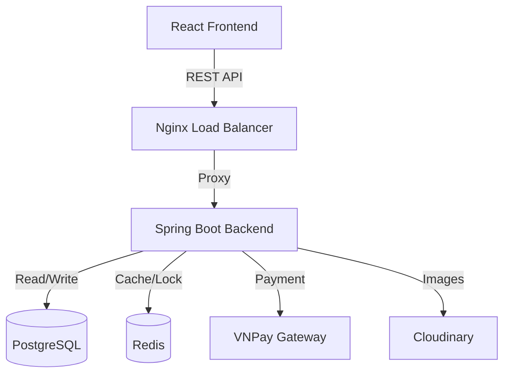

# 🍔 Food Ordering E-commerce Platform


> A full-stack web application designed to streamline the online food ordering process. Featuring secure payments, real-time caching, and a containerized deployment pipeline.

---

## 📖 Introduction

This project is a comprehensive **Food Ordering System** built to handle complex e-commerce workflows. It bridges the gap between customers and food vendors with a secure, high-performance backend and a responsive frontend.

The system is engineered to handle high traffic using **Redis** for caching and rate limiting, and ensures secure transactions via **VNPay** integration.

### 🎥 Live Demo / Screenshots
*(Place your screenshots or GIFs here. Examples:)*
| Home Page | Menu & Cart | Admin Dashboard |
|:---:|:---:|:---:|
|  |  |  |

---

## 🛠️ Tech Stack

### Backend
* **Core:** Java 17, Spring Boot 3
* **Database:** PostgreSQL (Primary), Redis (Caching & Locking)
* **Security:** Spring Security, JWT (Access/Refresh Tokens), BCrypt
* **Payment:** VNPay Gateway (HMAC SHA512)

### Frontend
* **Framework:** React 18
* **HTTP Client:** Axios
* **Media:** Cloudinary (Image Management)

### DevOps & Tools
* **Containerization:** Docker, Docker Compose
* **CI/CD:** GitHub Actions
* **Monitoring:** Prometheus, Grafana
* **Server:** Nginx

---

## 🚀 Key Features

### 🔐 Security & Authentication
* **Role-Based Access Control (RBAC):** Distinct flows for Admin, Staff, and Customer.
* **Advanced Auth:** JWT implementation with Token Blacklisting (via Redis) and OTP verification.
* **Rate Limiting:** Protects APIs from spam/abuse using Redis.

### 🛒 Order Management
* Complete workflow: Browse Product -> Add to Cart -> Checkout -> Payment -> Order Tracking.
* Real-time inventory checks using **Distributed Locking** (Redis) to prevent over-selling.

### 💳 Payment Integration
* Seamless integration with **VNPay**.
* Secure webhook handling with checksum validation (HMAC SHA512) to ensure data integrity.

### ⚡ Performance
* **Redis Caching:** Accelerates product retrieval and session management.
* **Optimized Queries:** Spring Data JPA with efficient indexing.

---

## 🏗️ System Architecture

This project follows a **Layered Architecture** to ensure separation of concerns and maintainability.



## ⚡ Installation & Setup

### Prerequisites
* Java 17+
* Node.js & npm
* Docker & Docker Compose

### Option 1: Quick Start with Docker (Recommended)

The entire system (Database, Redis, Backend, Frontend) can be spun up with a single command.

```bash
# 1. Clone the repository
git clone https://github.com/haolor/ktpm-team.git
cd ktpm-team

# 2. Build and run containers
docker-compose up --build -d
```

### Option 2: Manual Setup

#### 1. Backend Setup
```bash
cd backend
# Update application.properties with your DB/Redis/Cloudinary credentials
./mvnw clean install
./mvnw spring-boot:run
```

#### 2. Frontend Setup
```bash
cd frontend
npm install
npm run dev
```

---

## 🧪 Testing

* **Unit Testing:** JUnit 5 integration for Service and Repository layers.
* **API Testing:** Postman collection available in `/docs/postman_collection.json`.

---

## 👥 Contributors

This project was developed by a team of 4 dedicated engineers:

| Name | Role | GitHub |
|:---:|:---:|:---:|
| Dang Minh Hao (Me) | Backend Developer & System Design | @haolor |
| Tran Trung Kien | Backend Lead | @kunengineer |
| Nguyen Ba Vu Khoa | Frontend Developer | @nguyenbavukhoa |
| Vu Van Minh | DevOps & Testing | @VanMinh2410 |

---

## 📝 License

This project is licensed under the MIT License - see the LICENSE file for details.

<p align="center">Built with ❤️ by Dang Minh Hao</p>